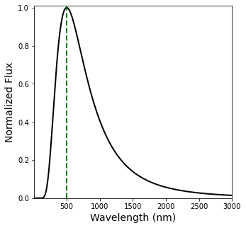

# Chapter 3: The Continuous Spectrum of Light

[3.1 Stellar Parallax](#section_1)

[3.2 The Magnitude Scale](#section_2)

[3.3 The Wave Nature of Light](#section_3)

[3.4 Blackbody Radiation](#section_4)

[3.5 The Quantization of Energy](#section_5)

[3.6 The Color Index](#section_6)

----

<a id='section_1'></a>
## 3.1 Stellar Parallax

To understand how intrinsically bright a star is, one must first know the distance to the star.  Most ancient civilizations believed that all the stars were fixed in the sky **and** the same distance away from us.  The ancient greeks, most notably [Ptolemy](http://atropos.as.arizona.edu/aiz/teaching/a204/lecture14.html), devised a method to determine the distance to the Moon using the apparent change in the Moon's position relative to the background stars.  This was one of the first uses of *parallax*, where the baseline used was the radius of the Earth (determined earlier by Eratosthenes).

Although the distance to the Moon could be calculated, the distance to each of the planets was unknown.  Kepler's laws in their original form describe the *relative sizes* of the planetary orbits.  During 17th Century, the relative distances were given in astronomical units (thanks to Edmund Halley) due to the gap in our ability to measure the Solar System.  The true scale of the Solar System was partially revealed through a transit of [Venus](https://skyandtelescope.org/astronomy-news/transits-of-venus-in-history-1631-1716/) in 1761, which was originally proposed by [Halley](https://www.eso.org/public/outreach/eduoff/vt-2004/Education/EduSheet2.html).

```I recommend it therefore again and again to those curious astronomers who, when I am dead, will have an opportunity of observing these things, that they remember my admonition, and diligently apply themselves with all imaginable success; in the first place, that they may not by the unreasonable obscurity of a cloudy sky be deprived of this most desirable sight, and then, that having ascertained with more exactness the magnitudes of the planetary orbits, it may redound to their immortal glory. --Edmund Halley```

The method used is called **trigonometric parallax**, which is the measurement of the angular displacement of an object from two different vantage points and is related to the known distance between such points.  For example, the distance to the peak of a mountain can be determined by the peak's angular position from two observation points separated by a known *baseline* distance.  Simple trigonometry (i.e., similar triangles) deduces the distance to the peak (see [Figure 1](https://github.com/saturnaxis/PHYS4410/blob/main/Chapter_3/Figure_1.jpg)).

The perceived angular displacement is smaller as the distance to the object increases and hence, finding the distance to the nearest stars requires a longer baseline than Earth's diameter.  Luckily, we can obtain a much longer baseline for free because the Earth's position relative to the Sun changes (i.e., the Earth orbits the Sun) and we obtain a different vantage point every 6 months.  The new baseline is equal to the diameter of Earth's orbit (2 AU) and will reveal the back-and-forth change in position of nearby stars.  We must remember that the stars themselves could be moving (i.e., the star's *proper motion*) and this motion can be determined after removing the known periodic motion due to the change in Earth's position.  The measurement of the **parallax angle** $p$ (the *half*-angle of the full angular displacement) determines the distance $d$ to the star by:

$\begin{aligned}
d = \frac{1\; AU}{\tan p} \approx \frac{1}{p}\; AU 
\end{aligned}$ 

where the small-angle approximation $\tan p \approx p$ is applied and $p$ is measured in **radians**.  In most instances, the parallax angle $p$ is not measured in radians, but in *arcseconds* and requires an appropriate conversion by:

$\begin{aligned}
d = \frac{1}{p} \times \frac{180^\circ}{\pi} \times \frac{3600^{\prime\prime}}{1^\circ} \; AU \approx \frac{206,265}{p^{\prime\prime}} \; AU
\end{aligned}$,

where $p^{\prime\prime}$ is the parallax angle in arcseconds (see [Figure 2](https://github.com/saturnaxis/PHYS4410/blob/main/Chapter_3/Figure_2.jpg)).  The nearest Sun-like stars lie in a binary system called $\alpha$ Centauri, which has a parallax angle of 754 $\pm$ 4.11 mas (milliarcseconds; [Pourbaix & Boffin (2016)](https://arxiv.org/abs/1601.01636)).  

-  **What is the distance to $\alpha$ Centauri (in AU)?**  (Verify with a calculator.)
    -  Why is my answer different from your calculator?


```python
import numpy as np #importing numpy because we need \pi

def p2AU(p):
    #p = parallax angle (in arcseconds)
    p *= (1./3600.)*np.pi/180. # converts p to radians
    d = 1./p # distance in AU
    return d

p_aCen = 754./1000. #convert 754 mas to arcseconds
print("Alpha Cen AB is %d AU away." % np.round(p2AU(p_aCen),-3))
```

    Alpha Cen AB is 274000 AU away.


The nearest stars are really, really far away and measuring the distance to stars in AU isn't practical for the same reason that we don't typically measure the distance between planets in meters.  Thus, we define a new unit called the **parsec** (**par**allax-**sec**ond, abbreviated as pc), which is the distance given 1 arcsecond of parallax (i.e., a normalization).  Our distance equation then becomes:

$\begin{aligned}
d = \frac{1}{p^{\prime\prime}} \;pc. \quad\quad\quad\quad {\rm (Equation\; 1)}
\end{aligned}$

To convert these *astronomical* distances into *physical* distances (i.e., meters), astronomers use the **light-year** or the distance that light travels through a vacuum in one Julian year (365.25 days).  One parsec is equal to 3.2615638 ly.

The first successful measurement of stellar parallax was made in 1838 by Friedrich Bessel (1784-1846).  He measured a parallax angle of 0.316 arcseconds for 61 Cygni and took 4 years of observation.  Prior to Bessel, others had tried to measure a [stellar parallax](https://en.wikipedia.org/wiki/Stellar_parallax) but the aberration due to the optics (at the time) stymied all of those efforts.

-  **What is the distance to $\alpha$ Centauri (in pc)?**
-  **What is the distance to $\alpha$ Centauri (in ly)?**


```python
def p2PC(p):
    #p = parallax angle (in arcseconds)
    d = 1./p
    return d
def p2LY(p):
    #p = parallax angle (in arcseconds)
    d = 3.2615638/p
    return d

p_aCen = 754./1000. #convert 754 mas to arcseconds
p_aCen_pc = p2PC(p_aCen)
p_aCen_ly = p2LY(p_aCen)
print("Alpha Cen AB is %1.2f pc away." % np.round(p_aCen_pc,2))
print("Alpha Cen AB is %1.2f ly away." % np.round(p_aCen_ly,2))
```

    Alpha Cen AB is 1.33 pc away.
    Alpha Cen AB is 4.33 ly away.


Proxima Centauri (the M-dwarf that is loosely bound to $\alpha$ Cen AB) has a parallax angle of 768.0665 $\pm$ 0.0499 ([Gaia Collaboration](https://arxiv.org/abs/2012.01533)).

-  **Is Proxima Cen closer or farther away than $\alpha$ Cen AB?**


```python
p_pCen = 768.0665/1000. #convert 754 mas to arcseconds
p_pCen_pc = p2PC(p_pCen)
p_pCen_ly = p2LY(p_pCen)
print("Prox Cen is %1.6f pc away." % np.round(p_pCen_pc,6))
print("Prox Cen is %1.6f ly away." % np.round(p_pCen_ly,6))
pct_dist = (1-p_pCen_ly/p_aCen_ly)*100.
print("Prox Cen is %1.2f%% closer than Alpha Cen AB." % pct_dist)
```

    Prox Cen is 1.301971 pc away.
    Prox Cen is 4.246460 ly away.
    Prox Cen is 1.83% closer than Alpha Cen AB.


Small angles can be very difficult to measure on Earth's surface because of atmospheric turbulence (i.e., twinkling makes a difference for precise measurements) and seismic activity which can affect the pointing accuracy.  Astronomers and engineers worked together to produce several space telescopes dedicated to precise and accurate parallax measurements of the nearest stars.  From 1989--1993, the European Space Agency (ESA) operated the Hipparcos Space Astrometry Mission, which was able to measure parallax angles with accuracies approaching 0.001 arcseconds for over 118,000 stars.

The successor to Hipparcos was the [Gaia parallax survey](http://ned.ipac.caltech.edu/level5/March19/Mignard/Mignard3.html) and is currently (as of Dec 2021) in operation.  Gaia will measure the parallax of 1.14 *billion* stars and obtain proper motions for 2 million of those stars.  Gaia's precision is 25 ${\rm \mu as}$ or 0.025 mas.  It increases our distance horizon to ~30,000 ly.

### **Problems**
>1\. In 1672, an international effort was made to measure the parallax angle of Mars at the time of opposition (when it was closest to Earth; see [Figure P1](https://github.com/saturnaxis/PHYS4410/blob/main/Chapter_3/Figure_P1.jpg)).  Consider two observers who are separated by a baseline equal to Earth's diameter.  
>> If the difference in there measurements of Mars' angular position is 33.6 $^{\prime\prime}$, what is the distance between Earth and Mars at the time of opposition? Express your answer both in units of m and in AU.

>2\. The parallax angle for Sirius is 0.3745 $^{\prime\prime}$.
>> Find the distance to Sirius in units of (i) parsecs and (ii) AU


----

<a id='section_2'></a>
## 3.2 The Magnitude Scale
Astronomers use light (i.e., electromagnetic radiation) to decode the physical nature of stars, galaxies, and the interstellar medium.  Technological advancements make a big difference in how we can measure light.  Our eyes measure how bright objects appear as an integrated flux (i.e., number of photons reaching the retina per second), where brighter sources represent a larger integrated flux.  Stars emit radiation in all directions, but only a sliver of the total radiation ever reaches our eyes.  The nature of space augments how we receive this radiation, where a closer source fills a larger surface area than a distant one.  Hence, astronomers have developed different scales over time to account for the ambiguity of brightness due to the distance to the source.

### 3.2.1 Apparent Magnitude
Ancient people (e.g., Greeks, Persians, Egyptians, etc.) developed methods to identify patterns of stars and identified differences in the apparent brightness.  Records of these observations were collected to form star charts and sky catalogs.  Hipparchus, a Greek astronomer, compiled a list of ~850 stars and invented a numerical scale to describe how bright each star appeared in the sky.  He assigned an [**apparent magnitude**](https://en.wikipedia.org/wiki/Apparent_magnitude) $m = 1$ for the brightest stars in the (Greek) night sky, where a magnitude $m=6$ represented the faintest stars (note that a larger magnitude corresponds to a fainter object).  This scale was widely used by later astronomers, but non-standardized.  Through the Renaissance, Hipparchus' scale was revisited and modified to reflect the contemporary view that the human eye responds logarithmically to identify the difference in brightness of two objects.  

Hipparchus' scale was changed so that the difference between magnitudes maintained a *constant ratio* in brightness.  The difference between Hipparchus' brightest and faintest object was 5 (e.g., 6-1=5) and scientists at the time (19th Century) decided that this represents a factor of 100 difference in brightness.  Each magnitude increase is equivalent to raising the brightness by an exponent by the following:

$\begin{aligned}
100^{(m_2-m_1)/5} = \Delta B  \quad\quad\quad\quad {\rm Equation \;2}
\end{aligned}$

where the apparent magnitude of each star ($m_1$ and $m_2$) is related the the relative change in brightness $\Delta B$.  A 1 magnitude difference corresponds to a change in brightness, $\Delta B = 2.511886... \approx 2.512$.

Modern [photometric](https://en.wikipedia.org/wiki/Photometry_(astronomy) detectors allow astronomers to measure the apparent magnitude of an object with an [accuracy](http://slittlefair.staff.shef.ac.uk/teaching/phy217/lectures/stats/L18/index.html) of $\pm$ 0.001 magnitude and the differences in magnitudes $\pm$ 0.0001 (or ~100 ppm flux differences).  The brightest object detected (from Earth) is the Sun (m = -26.74) and the faintest is a small ($\sim$ 15 m in diameter) Kuiper Belt Object (KBO) (m = +28.4) observed by the Hubble Space Telescope (HST) in 2003.  HST's theoretical limit is m = +31.5 and the James Webb Space Telescope (JWST) will push this horizon to m = +34.

-  **How much fainter will JWST be capable of detecting compared to HST?**

### 3.2.2 Flux, Luminosity, and the Inverse Square Law
The "brightness" of a star is measured as the total amount of radiation (at all wavelengths) that crosses a unit area per unit time as is called the **radiant flux**.  This definition depends on the intrinsic **luminosity** (energy emitted per second at the stellar surface) and the distance of the source from the unit area (i.e., distance from the observer).  The same star located at a farther distance will appear less bright in the sky.

Astronomers scale the brightness using a spherically symmetric shell of radius *r* to designate where the unit area is located.  Assuming a vacuum between the source and the surface of the shell, the radiant flux ($F$) can be defined as:

$\begin{aligned}
F = \frac{L}{4\pi r^2}, \quad\quad\quad\quad {\rm (Equation\; 3)}
\end{aligned}$

where the luminosity $L$ is distributed uniformly across the surface area of the shell.  This is the well-known **inverse square law** for light.  The radiant flux of some stars are given relative to the Solar Luminosity ($L_\odot$) and the Earth-Sun distance ($r_\oplus$) so that the factor $4 \pi$ isn't needed as:

$\begin{aligned}
\frac{F}{F_\oplus} = \frac{L}{L_\odot}\left(\frac{r_\oplus}{r}\right)^2.
\end{aligned}$

-  **How much radiant flux does the Earth receive from the Sun?**


```python
def calc_Flux(L,r):
    #L = Luminosity of the source
    #r = distance from the source
    F = L/(4*np.pi*r**2)
    return F
L_sun = 3.828e26 #(in W) Solar luminosity defined by the IAU (International Astronomical Union)
AU = 1.495978707e11 #(in m) Astronomical Unit (tied to the defintion of a meter)

F_Earth = calc_Flux(L_sun,AU)
print("The solar flux is: %4d W/m^2" % np.round(F_Earth,0))
```

    The solar flux is: 1361 W/m^2


The value of the solar flux is also known as the solar irradiance or **solar constant**.  This value is used when determining a planet's potential "habitability" and in climate modeling of the Earth's atmosphere.

### 3.2.3 Flux Ratios and Apparent Magnitude
In the given alternate form of the radiant flux ($F/F_\oplus$), it is scaled to a standard distance and luminosity.  While this scaling is useful for studying exoplanets, we can combine the formula for radiant flux with the magnitude scale to determine the relative flux of different stars.  Let's start by defining the flux ratio ($F_2/F_1$) as:

$\begin{aligned}
\frac{F_2}{F_1} = \frac{L_2}{L_1}\left(\frac{r_1}{r_2}\right)^2. 
\end{aligned}$

Then, we simply set the flux ratio equal to the change in brightness (Equation 2) by

$\begin{aligned}
\frac{F_2}{F_1} = 100^{(m_1-m_2)/5} = 10^{\frac{2}{5}(m_1-m_2)}. \quad\quad\quad\quad {\rm (Equation\; 4)}
\end{aligned}$

Taking the base-10 logarithm of both sides leads to the alternative form:

$\begin{aligned}
2.5\log_{10} \left( \frac{F_2}{F_1} \right) = m_1-m_2.  \quad\quad\quad\quad {\rm (Equation\; 5)}
\end{aligned}$

- **Compare Equation 5 (above) to the Equation 4 in the textbook.  How are they different?**

- **Given the apparent magnitude of the Sun ($m_{Sun} = -26.74$) and the full Moon ($m_{Moon} = -12.74$).  How much brighter is the Sun compared to the Moon?**


```python
def Flux_ratio(m_1,m_2):
    #m_1 = apparent magnitude of source 1
    #m_2 = apparent magnitude of source 2
    F_ratio = 100**(0.2*(m_1-m_2))
    return F_ratio

m_sun = -26.74 #apparent magnitude of the Sun
m_moon = -12.74 #apparent magnitude of the Moon (at Full)
F_ratio = Flux_ratio(m_moon,m_sun)

print("The Sun is %2d times brighter than the Moon or a difference of %2.2f magnitudes." % (np.round(F_ratio,-2),np.round(m_moon - m_sun,2)))
```

    The Sun is 398100 times brighter than the Moon or a difference of 14.00 magnitudes.


### 3.2.4 Absolute Magnitude and the Distance Modulus
A common normalization is to determine a star's **absolute magnitude (M)**, which is how bright would a star appear *if* it were located 10 pc away from the Earth.  An important point is that we are determining how the apparent magnitude of the *same star* differs when it is at two *different distances* from us (i.e., $L_1 = L_2$).  Under this assumption the flux ratio becomes

$\begin{aligned}
\frac{F_2}{F_1} =\left(\frac{r_1}{r_2}\right)^2 = 10^{\frac{2}{5}(m_1-m_2)}. 
\end{aligned}$

Under the definition of the absolute magnitude, we set $m_2 = M$, $m_1 = m$, and $r_2 = 10$ pc.  This forces $r_1$ into units of pc and the most common notation changes $r_1\rightarrow d$.  We now have,

$\begin{aligned}
\left(\frac{d}{10 \;pc}\right) = 10^{(m-M)/5}, 
\end{aligned}$

and the standard distance of 10 pc is "baked-in" to the definition of the absolute magnitude.  Solving for $d$ (the star's distance), we arrive at

$\begin{aligned}
d = 10^{(m-M+5)/5}\;{\rm pc}.  \quad\quad\quad\quad {\rm (Equation\; 6)}
\end{aligned}$

-  **Where does the extra +5 in Equation 6 come from?**

The quantity $m-M$ is a measure of the distance to a star and is called the star's **distance modulus**.  Solving for $m-M$ instead of $d$ results in

$\begin{aligned}
m - M = 5\log_{10}\left(\frac{d}{10 \;pc}\right).  \quad\quad\quad\quad {\rm (Equation\; 7)}
\end{aligned}$

-  **What is the absolute magnitude of the Sun?**
    - Why does your answer differ from the textbook?
-  **What is the distance modulus of the Sun?**
    - Why does your answer *not* differ from the textbook?


```python
def calc_AbsMag(m,d):
    #m = apparent magnitude of the source
    #d = distance to the source in pc
    M = m - 5*np.log10(d/10.)
    return M

m_sun = -26.83 #apparent magnitude of the Sun
d = np.pi/(180*3600) #1 AU in pc using defintion from Sec. 3.1
M_sun =calc_AbsMag(m_sun,d)
print("The absolute magnitude of the Sun is %1.3f" % np.round(M_sun,3))
print("The distance modulus for the Sun is %2.2f" % np.round(m_sun-M_sun,2))
```

    The absolute magnitude of the Sun is 4.742
    The distance modulus for the Sun is -31.57


Since the absolute magnitude places a star at a standard distance (10 pc), one might wonder how our derivations might change given the absolute magnitudes of two stars, $M_1$ and $M_2$.  With the absolute magnitude, we can treat both stars as being the same distance away from the Earth (i.e., $r_1 = r_2$).  Thus, the flux ratio ($F_2/F_1$) and luminosity ratio ($L_2/L_1$) are equivalent.  Equation 5 becomes

$\begin{aligned}
2.5\log_{10} \left( \frac{L_2}{L_1} \right) = M_1-M_2  \quad\quad\quad\quad {\rm (Equation\; 8)}
\end{aligned}$

or 

$\begin{aligned}
-2.5\log_{10} \left( \frac{L}{L_\odot} \right) = M-M_{Sun},  \quad\quad\quad\quad {\rm (Equation\; 9)}
\end{aligned}$

when compared to values of the Sun ($L_2 = L_\odot$ and $M_2 = M_{Sun}$).

### **Problems**

>3\. At what distance from a 100 W light bulb is the radiant flux equal to the solar irradiance?
>
>4\. Determine the distance modulus for Sirius (using your answer from Problem 2).
>
>5\. What is the luminosity ratio between Sirius and the Sun?


----

<a id='section_3'></a>
## 3.3 The Wave Nature of Light
Light is the vessel by which information flows through the universe.  Astronomers must take advantage of all its properties because it appears unlikely that we will be visiting even the most nearby stars anytime soon.

### 3.3.1 The Speed of Light
The speed of light was first estimated (with some accuracy) by Ole Roemer in 1675.  Galileo made his first the telescope in 1609, where Roemer was using a telescope to study Jupiter's moons by their eclipses.  Roemer used Kepler's laws to determine the timing of future eclipses, where a similar method would be used 400 years later to study exoplanets.  Newton's version of Kepler's 3rd Law wasn't published until 1687, which means that Roemer was using Kepler's original definition without universal gravitation.

Roemer discovered that the timing of the eclipses differed depending on the relative positions of the Earth and Jupiter.  At closest approach (opposition), the eclipses occurred earlier and as the Earth started moving away, the eclipses occurred behind schedule.  This is called the light-time effect ([LITE](http://www.astro.sk/caosp/Eedition/FullTexts/vol43no3/pp493-497.pdf)) and it arises due to the finite speed of light.  Roemer found that 22 minutes was required for light to cross the diameter of Earth's orbit, where the modern estimate is ~16 minutes.  If Roemer was able to measure the Earth's orbital diameter precisely (i.e., using meters), then he could determine the [speed of light](https://www.universetoday.com/38040/speed-of-light-2/) to 2 significant figures.  The modern value for the speed of light is defined to be $c = 2.99792458 \times 10^8$ m/s.  However, there are several disciplines of astronomy (e.g., cosmology) that parameterize their equations so that $c = 1$.

### 3.3.2 Young's Double-Slit Experiment
During the Renaissance, scientists uncovered that two different interpretations of light explained a range of phenonmena.  Newton posited that light was a stream of particles because it explaned the sharpness of shadows.  But, Chistiaan Huygens suggested that light was composed of waves because it behaved similarly to other known waves (e.g., water and sound).  Both models could explain the phenomena of reflection and refraction.

The mathematical theory of waves are described by three properties: **wavelength**, **frequency** and **wave speed**.  The wavelength $\lambda$ is the distance between successive wave crests/troughs and the frequency $\nu$ is the number of waves that pass a point in space per unit of time.  Therefore the wave speed $c$ is determined by the product of the wavelength and frequency by

$\begin{aligned}
c = \lambda \nu \quad\quad\quad\quad {\rm (Equation\; 10)}.
\end{aligned}$

The particle nature of light was accepted as the *true* representation, largely based on Netwon's reputation.  Thomas Young (1773-1829) demonstrated the wave nature of light through his famous double-slit experiment.  *Note:* [Thomas Young](https://en.wikipedia.org/wiki/Thomas_Young_(scientist)) was also instrumental in deciphering the Rosetta Stone, which unlocked the many mysteries of Ancient Egypt.

For a double slit experiment, monochromatic light with a wavelength $\lambda$ from a single source passes through two narrow, parallel slits that are separated by a distance $d$.  There is a screen at a distance $L$ beyond the two slits.  A wave model of light predicts that light and dark *interference* fringes should be observed.  As the light passes through the slits, the waves spread out radially as though the slits are wave sources with a succession of crests and troughs.  Waves obey a *superposition* principle where the two interacting waves add linearly (e.g., $\psi = A\psi_1 + B\psi_2$).  When the wave crests meet at the same time, a bright fringe or maximum is produced (i.e., **constructive** interference).  On the other hand, when the crest from one wave meets the trough of another, then the waves cancel each other out producing a dark fringe or minimum (i.e., **destructive** interference).


```python
import matplotlib.pyplot as plt

t_step = 0.01
t = np.arange(0,2.*np.pi+t_step,t_step)
P_1 = 2./3.
psi_1 = np.cos((2.*np.pi/P_1)*t)
psi_2 = np.cos((2.*np.pi/(2*P_1))*t)
psi = 2*psi_1 + psi_2

fig = plt.figure(figsize=(14,5))
ax1 = fig.add_subplot(121)
ax2 = fig.add_subplot(122)

ax1.plot(t,psi_1,'.',color='orange',lw=2)
ax1.plot(t,psi_2,'.',color='blue',lw=2)
ax2.plot(t,psi,'.',color='green',lw=2)

xticks = np.arange(0,9.*np.pi/4,np.pi/4)
ax1.set_xticks(xticks)
ax2.set_xticks(xticks)
xtick_labels = ['0',"$\pi$/4","$\pi$/2","$3\pi$/4","$\pi$","$5\pi$/4","$3\pi$/2","$7\pi$/4","$2\pi$"]
ax1.set_xticklabels(xtick_labels)
ax2.set_xticklabels(xtick_labels)

ax1.set_xlim(0,2.*np.pi)
ax2.set_xlim(0,2.*np.pi)
```


    (0.0, 6.283185307179586)


The interference pattern depends on the difference in the optical path length for each set of waves.  If $L\gg d$, the waves arrive *in-phase*, where the path difference is approximated by $d\sin \theta$ and the number $n$ of wavelengths is a whole number.  The waves will be *out-of-phase* when the number of wavelengths in the path difference is equal to a half-integer.  For  $L\gg d$, the angular position of the bright and dard fringes for **double-slit** interference are given by

$\begin{aligned}
d \sin \theta = \begin{cases}
n \lambda \quad\quad\quad (n=0,1,2,\ldots;\; {\rm bright\;fringes}) \\
(n-\frac{1}{2})\lambda \quad\quad (n=1,2,\ldots;\; {\rm dark\; fringes}).
\end{cases} \quad\quad ({\rm Equation \; 11})
\end{aligned}$

The integer $n$ represents the **order** of the maximum or minimum.  By measuring the fringes on the screen, Young was able to determine the wavelength of the light *before the development of spectra*.  [Table 1](https://github.com/saturnaxis/ModernAstro/blob/main/Chapter_3/Table_1.jpg) shows the range of wavelengths that astronomers utilize today.


```python
def find_lambda(d,theta,n,fringe):
    #d = distance between slits in (m)
    #theta = angle (in radians) away from central peak
    #n = order (n>0)
    #fringe = bright or dark
    d /= 1e-9 #convert m into nm for wavelength
    dsinth = d*np.sin(theta)
    if fringe == "bright":
        if n == 0:
            return print("Central peak at n = 0.")
        else:
            return print("Wavelength = %3.3f nm of bright fringe using order n = %d." % (dsinth/n,n))
    else:
        if n == 0:
            return print("Dark fringes start from n = 1.")
        else:
            return print("Wavelength = %3.3f nm of dark fringe using order n = %d." % (dsinth/(n-0.5),n))

d = 1e-3 #1 mm
theta = np.radians(0.25) #angle converted to radians
find_lambda(d,theta,0,'bright')
find_lambda(d,theta,6,'bright')
find_lambda(d,theta,0,'dark')
find_lambda(d,theta,10,'dark')
```

    Central peak at n = 0.
    Wavelength = 727.218 nm of bright fringe using order n = 6.
    Dark fringes start from n = 1.
    Wavelength = 459.296 nm of dark fringe using order n = 10.


### 3.3.3 Maxwell's Electromagnetic Wave Theory
Many discoveries were made in the 18th and 19th Century illustrating the properties of electricity and magnetism separately.  However, James Clerk Maxwell was the first to synthesize the prior knowledge and succeed in condensing everything known into *four* equations.  Maxwell found that his equations could produce wave equations for the electric ($E$) and magnetic ($B$) field vectors.  One of the main predictions was that these *electromagnetic waves* propogate through a vacuum with a characteristic speed $c = 1/\sqrt{\epsilon_o \mu_o}$, where $\epsilon_o$ and $\mu_o$ are constants of nature that describe the permitivity and permeability of free space.  These equations showed that electromagnetic waves are *transverse* waves and could exhibit polarization (see [Figure 5](https://github.com/saturnaxis/ModernAstro/blob/main/Chapter_3/Figure_5.jpg)). 

### 3.3.4 The Poynting Vector and Radiation Pressure
All waves carry both energy and momentum in the direction of propagation.  The energy flux of a light wave is called the **Poynting vector**,

$\begin{aligned}
\mathbf{S} = \frac{1}{\mu_o}\mathbf{E} \times \mathbf{B},
\end{aligned}$

where ${\bf S}$ has units of flux (W/m$^2$).  The Poynting vector points in a direction perpendicular to the planes locating the electric and magnetic field vectors.  The quantity of practical interest is the *time-averaged* magnitude of the Poynting vector over one cycle given as

$\begin{aligned}
\left<S\right> = \frac{1}{2\mu_o}E_o B_o, \quad\quad\quad\quad ({\rm Equation\; 12}) 
\end{aligned}$

where $E_o$ and $B_o$ represent the maximum amplitudes of the electric and magnetic fields, respectively.  Since the wave carries momentum, it can exert a force on a surface (e.g., light-sail).  The resulting [radiation pressure](https://en.wikipedia.org/wiki/Radiation_pressure) depends on whether the light wave is reflected from or absorbed by the surface.  The force of the radiation $F_{\rm rad}$ is related to the time-average flux $\left<S\right>$, the cross-sectional area $A$, the speed of light $c$, and the angle of incidence $\theta$ (e.g., $0^\circ$ is perpendicular to the surface). The radiation pressure is given by

$\begin{aligned}
P_{\rm rad} = \frac{F_{\rm rad}}{A} = \begin{cases}
\frac{\left<S\right>A}{c}\cos \theta; \quad\quad {\rm absorption}\quad\quad ({\rm Equation\;13}) \\
\frac{2\left<S\right>A}{c}\cos^2 \theta, \quad\quad {\rm reflection}\quad\quad ({\rm Equation\;14}) 
\end{cases}
\end{aligned}$

where the radiation force due to a absorption has a factor of $\cos \theta$ corresponding to the incident beam and the force due to a reflection has an additional $2\cos \theta$ from the reaction force component that is perpendicular to the surface (see [Figure 6](https://github.com/saturnaxis/ModernAstro/blob/main/Chapter_3/Figure_6.jpg)).  Radiation pressure has a negligible effect under everyday conditions on Earth.  But small objects, such as dust grains or even asteroids, can experience dramatic effects.  For example, the rings of Saturn are slowly driven into the planet due to radiation pressure from the Solar wind and cosmic rays (e.g., [Jontof-Hutter & Hamilton (2012)](https://arxiv.org/abs/1201.3578)).


----

<a id='section_4'></a>
## 3.4 Blackbody Radiation

### 3.4.1 The Connection between Color and Temperature
The start of thermodynamics begins in earnest in the 19th Century.  Just prior to this epoch (in 1792), Thomas Wedgewood noticed that all of his ovens used to make porcelain becaume red-hot at the same tempearture, independent of their size, shape, and construction.  Further investigation revealed that all objects emit light at all wavelengths with a varying degree of efficiency.  A special case was proposed where the object absorbs all of the incident light energy and re-radiates the incident energy with a characteristic spectrum.  Since this object reflects no light, it is known as a **blackbody** and the emitted energy is **blackbody radiation**.  Stars are blackbodies, at least to a rough first approximation.

|  |
|:--:|
| **Figure 7** Blackbody radiation as a function of wavelength for various temperatures. Each temperature curve peaks at a different wavelength and Wien's law describes the shift of that peak. (wikipedia:[Wien's Law](https://en.wikipedia.org/wiki/Wien%27s_displacement_law))|

A blackbody of temperature $T$ emits a continuous spectrum with some energy at all wavelengths with a maximum intensity occurring at a wavelength $\lambda_{\rm max}$.  **Wien's displacement law** describes the relationship between the temperature and the maximum wavelength as

$\begin{aligned}
\lambda_{\rm max}T = 2.897744 \times 10^6 \; {\rm nm\;K}. \quad\quad\quad\quad ({\rm Equation\; 15}) 
\end{aligned}$

- **What is the maximum (peak) wavelength for [Betelguese](https://en.wikipedia.org/wiki/Betelgeuse) and [Rigel](https://en.wikipedia.org/wiki/Rigel)?**


```python
def calc_lambda_max(T):
    #T = temperature in K
    b = 2.897755e6 #constant for Wien's law (converted to nm*K)
    return b/T 
lam_Betel = calc_lambda_max(3600)
print("The maximum wavelength for Betelguese is: %3d nm (infrared)" % np.round(lam_Betel,-2))
lam_Rigel = calc_lambda_max(12100)
print("The maximum wavelength for Rigel is: %3d nm (UV)" % np.round(lam_Rigel,0))
```

    The maximum wavelength for Betelguese is: 800 nm (infrared)
    The maximum wavelength for Rigel is: 239 nm (UV)


### 3.4.2 The Stefann-Boltzmann Equation
Figure 7 illustrates that the spectral energy density increases (i.e., more intensity) for a higher surface temperature.  In 1879, Josef Stefan showed that the luminosity $L$ of a blackbody is proportional to the surface area $A$ and temperature $T$ (in K).  Five years later, Ludwig Boltzmann derived an equation using the laws of thermodynamics and Maxwell's formula for radiation pressure.  Now called the **Stefan-Bolzmann equation**, it forms an equality for the luminosity as

$\begin{aligned}
L = \sigma A T^4, \quad\quad\quad\quad ({\rm Equation\; 16}) 
\end{aligned}$

where $\sigma$ represents the [Stefan-Boltzmann constant](https://en.wikipedia.org/wiki/Stefan%E2%80%93Boltzmann_constant) and $\sigma = 5.670374419\ldots \times 10^{-8}\; {\rm W}\;{\rm m}^{-2}\;{\rm K}^{-4}$; Note the level of precision is determined by its definition through other fundamental constants.  For a spherical star of Radius $R$, the surface area $A = 4\pi R^2$.  Since stars are not perfect blackbodies, the equation is redefined in terms of the **effective temperature** $T_e$ on a star's surface.  Combining with the equation for flux $F = L/A$, the *surface flux* is $F_{\rm surf} = \sigma T_e^4$.

-  **What is the surface flux of the Sun and the corresponding peak wavelength $\lambda_{\rm max}$?**


```python
def calc_surf_temp(L,R):
    #L = luminosity (in W)
    #R = radius (in m)
    T_e = (L/(4*np.pi*R**2*sigma))**0.25
    return T_e
sigma =  5.670374419e-8
L_sun = 3.828e26 #Solar luminosity in W
R_sun = 6.957e8 #Solar radius in m
T_sun = calc_surf_temp(L_sun,R_sun)
print("The surface temperature of the Sun is %4d K" % np.round(T_sun,0))
print("The surface flux of the Sun is %1.3e W/m^2" % (sigma*T_sun**4))
lambda_sun = calc_lambda_max(T_sun)
print("The maximum wavelength for the Sun is: %3.1f nm (visible)" % np.round(lambda_sun,1))
```

    The surface temperature of the Sun is 5772 K
    The surface flux of the Sun is 6.294e+07 W/m^2
    The maximum wavelength for the Sun is: 502.0 nm (visible)


**Problems**
>6\.The average person has 1.4 m<sup>2</sup> of skin with a temereature of roughly 306 K.  Consider the averge person to be an ideal radiator standing in an empty room at 293 K.
>>**(a)** Calculate the luminosity radiated by the average person.  Express your answer in watts.

>>**(b)** Determine the peak wavelength $\lambda_{\rm max}$ emitted by the average person and the range of the electromagnetic spectrum where the peak wavelength is found.

>>**(c)** Calculate the energy absorbed by the average person, expressed in watts.

>>**(d)** Calculate the *net* energy exchange between the average person and the room.


----

<a id='section_5'></a>

## 3.5 The Quantization of Energy

### 3.5.1 Rayleigh-Jeans and Wein Approximation
Although the blackbody curves could be determined empirically, physicists wanted to derive an equation from fundamental physics (first) principles.  Lord Rayleigh developed a formula based on Maxwell's equations and thermal phsyics.  His strategy considered a cavity of temeperature $T$ filled with radiation (i.e., a hot oven filled with standing waves).  If $L$ is the distance between the oven's walls, then the standing waves will appear at wavelengths $\lambda = 2L/n$ and $n$ is an integer.  Each of those wavelengths should receive a packe of energy (E = kT), where $k = 1.3806503 \times 10^{-23} J/K$ is Boltzmann's constant from chemistry.  Rayleigh derived an approximation for $B_\lambda(T)$ that was valid for large (long) $\lambda$ as

$\begin{aligned}
B_\lambda(T) \approx \frac{2ckT}{\lambda^4}, \quad\quad\quad\quad ({\rm Equation\; 17}) 
\end{aligned}$

and agrees well with the blackbody curve for long $\lambda$.  However, this result explodes for short $\lambda$ (i.e., $\displaystyle \lim_{\lambda\rightarrow 0} B_\lambda(T) = \infty$).  The theoretical results was dubbed the "ultraviolet catastrophe" and is known today ast he **Rayleigh-Jeans law**.

At the same time, Wien worked on his own [approximation](https://en.wikipedia.org/wiki/Wien_approximation) starting from the Stefan-Boltzmann law.  He developed a formula that was accurate at *short* wavelengths as 

$\begin{aligned}
B_\lambda(T) \approx a\lambda^{-5}e^{-\frac{b}{\lambda T}}, \quad\quad\quad\quad ({\rm Equation\; 18}) 
\end{aligned}$

where $a$ and $b$ were determined by a best-fit to the experimental data.

### 3.5.2 Planck's Function for the Blackbody Radiation Curve
Max Planck discovered a slight modification to Wien's approximation could fit the blackbody curves for both long and short wavelengths.  This modification was subtracting one from the exponential function as

$\begin{aligned}
B_\lambda(T) = \frac{a\lambda^{-5}}{e^{\frac{b}{\lambda T}}-1}. \quad\quad\quad\quad ({\rm Equation\; 19}) 
\end{aligned}$

To determine the constants $a$ and $b$, Planck assumed that a standing wave was allowed for only a specific energy value that was an integral multiple of a minimum wave energy.  The minimum energy (or quantum) is $h\nu$ (or $hc/\lambda$), where $h$ is a constant.  Given the assumption of quanitized wave energy, the problem of the ultraviolet catastrophe was avoided.  Equation 19 is now known as [**Planck's function**](https://en.wikipedia.org/wiki/Planck%27s_law), where $a=2hc^2$ and $b= (hc)/k$.  The value of $h$ is known as **Planck's constant** and is $h = 6.6206876 \times 10^{-34}$ J s.

- **What is the first derivative of $B_\lambda (T)$ (Eqn. 19)**? (*Verify your answer.*)


```python
import sympy as sym
from sympy.functions import exp
from sympy.abc import h,c,l,k,T
#l = lambda
B_lambda = sym.Function('B')
B_lambda = (2*h*c**2/l**5)/ (exp(h*c/(l*k*T))-1)

print(B_lambda.diff(l))
```

    -10*c**2*h/(l**6*(exp(c*h/(T*k*l)) - 1)) + 2*c**3*h**2*exp(c*h/(T*k*l))/(T*k*l**7*(exp(c*h/(T*k*l)) - 1)**2)


See the [SymPy](https://docs.sympy.org/latest/index.html) documentation for more details on its usage.


### 3.5.3 The Planck Function and Astrophysics
In spherical coordinates (see [Figure 9](https://github.com/saturnaxis/ModernAstro/blob/main/Chapter_3/Figure_9.jpg)), the radiant energy for a given wavelenth per unit time can be expressed from an element of surface area $dA$ as

$\begin{aligned}
L_\lambda d\lambda = \int \int \int B_\lambda(T)d\lambda dA \cos \theta \sin \theta d\theta d\phi . \quad\quad\quad\quad ({\rm Equation\; 20}) 
\end{aligned}$

At times it's more convenient to work with frequency intervals $d\nu$ rather than wavelength intervals.  In which case, $\nu d\nu = -\frac{c}{\lambda^2} d\lambda$ can be substituted in Equation 19 to determine $B_\nu(T)$.

The Planck function relates the observed properties of a star (e.g., radiant flux, apparent magnitude) and its intrinsic properties (e.g., radius and temperature).  Consider a star as a spherical blackbody of radius $R$ and temperature $T$.  Each small patch of surface $dA$ emits the same amount of radiation and the energy per second (luminosity) is

$\begin{aligned}
\displaystyle \int_{\phi=0}^{2\pi} \int_{\theta=0}^{\pi/2} \int_A B_\lambda(T)d\lambda dA \cos \theta \sin \theta d\theta d\phi = 4\pi^2 R^2 B_\lambda d\lambda. \quad\quad\quad ({\rm Equation\; 21}) 
\end{aligned}$

The angular integration ($\theta$,$\phi$) yields a factor of $\pi$, while the integral over the surface area $A$ produces a factor of $4\pi R^2$ (i.e., surface area of a sphere).  The result is the **monochromatic luminosity**, which is

$\begin{aligned}
L_\lambda d\lambda = \frac{8h(\pi Rc)^2/\lambda^5}{e^{\frac{hc}{\lambda kT}-1}}d\lambda. \quad\quad\quad ({\rm Equation\; 22}) 
\end{aligned}$

Integrating over all wavelengths leads to the Stefan-Boltzmann equation (see Equation 16). and the monochromatic flux can be obtained by simply dividing Equation 22 by $4\pi r^2$ (*r is the distance away from the sphere*).

**Problems**
>7\. Show that the Rayleigh-Jeans law is an approximation of the Planck function $B_\lambda$ in the limit of $\lambda \gg hc/(kT)$.  *Hint: the first-order expansion $e^x \approx 1 + x$ for $x \ll 1$ will be useful.*
>>**(a)** Plot the Planck function $B_\lambda$ and the Rayleigh-Jeans law for the Sun on teh same graph.  At roughly what wavelength is the the Rayleigh-Jeans value twice as large as the Planck function?

>8\. Derive Wien's law, by setting $d B_\lambda d\lambda = 0$.  *Hint: You will encounter an equation that must be solved numerically.*

>9\. The frequency form of the Planck function is given as

>>$\begin{aligned}
B_\nu (T) = \frac{2h\nu^3/c^2}{e^{\frac{h\nu}{kT}-1}}d\lambda. 
\end{aligned}$

>>**(a)** Find an expression at which $B_\nu$ attains its maximum value (i.e., $\nu_{\rm max}$).

>>**(b)** What is the value of $\nu_{\rm max}$ for the Sun?

>>**(c)** Find the wavelength of light corresponding to $\nu_{\rm max}$.  In what region of the electromagnetic spectrum is this wavelength?


----

<a id='section_6'></a>

## 3.6 The Color Index
Section 3.2 introduced the apparent $m$ and absolute magnitudes $M$, which provide the brightness measured over all wavelengths and corresponds to the **bolometric magnitude**.  

$\begin{aligned}
 M_{bol} = M_{Sun} - 2.5\log_{10}\left(\frac{L}{L_\odot}\right). \quad\quad\quad ({\rm Equation\; 23}) 
\end{aligned}$

In practice, detectors measure the radiant flux through a filter that allows only a certain wavelength region to pass through and reach the detector or the dectector is sensitive to a particular wavelength range (i.e., [CCDs](https://en.wikipedia.org/wiki/Charge-coupled_device)).

### 3.6.1 UBV Wavelength Filters
A star's *color* can be precisely measured using a filter that permits a narrow range of wavelengths (i.e., bands) to pass through.  Astronomers developed a standard *UBV*  photometric system (or [Johnson system](https://en.wikipedia.org/wiki/UBV_photometric_system)) to help classify stars by their color.  These three filters are designated by letter as:

- *U* (ultraviolet) magnitude, where the filter is centered at 365 $\pm$ 68 nm,

- *B* (blue) magnitude, where the filter is centered at 440 $\pm$ 98 nm,

- *V* (visual or green) magnitude, where the filter is centered at 550 $\pm$ 89 nm.

### 3.6.2 Color Indices and the Bolometric Correction
Using the distance modulus equation (Eqn. 7) and a known distance $d$, a star's absolute magnitude $M$ can be determined and a subscript is added to designate the magnitude within a particular band pass (e.g., $M_U$ is the $U$ magnitude).  A **color-index** is the difference between a star's *apparent* brightness in each of the standard wavelength filters.  For example:

- $U-B = M_U - M_B$

and 

-  $B-V = M_B - M_V$

represent the difference in stellar magnitudes between the filters.  Recall that a brighter star is denoted by a smaller (or more negative) value and vice versa for a dimmer star.  A star is deemed "blue" if its $M_B$ is brighter than its $M_V$ or $B-V$ is brighter.  A particular magnitude depends on the star's distance, but the difference of magnitudes is *independent* of the star's distance (see Eqn 8).  The difference between a star's bolometric magnitude and its visual magnitude is called the **bolometric correction** $BC$ or

$\begin{aligned}
BC = m_{bol} - m_V = M_{bol}-M_V. \quad\quad\quad ({\rm Equation\; 24}) 
\end{aligned}$

- **What are the color indices for [Sirius A](https://simbad.u-strasbg.fr/simbad/sim-id?Ident=TYC+5949-2777-1)?**

- **What is the bolometric correction for Sirius A ($L_A = 25.4 L_\odot$)?**


```python
def calc_Color_idx(M1,M2):
    #M1 = absolute magnitude of color 1
    #M2 = absolute magnitude of color 2
    return M1 - M2

def calc_Mbol(L_star):
    #M_bol = M_sun = 2.5*np.log_10(L/L_sun)
    #L_star = stellar luminosity in L_sun
    M_sun = 4.832 #Absolute magnitude of the Sun
    return M_sun - 2.5*np.log10(L_star)

m_A = [-1.51,-1.46,-1.46] #UBV apparent magnitude of Sirius A
d_A = p2PC(379.21*1e-3)
M_A = [] #UBV absolute magnitude of Sirius A
for i in range(0,3):
    M_color = calc_AbsMag(m_A[i],d_A)
    M_A.append(M_color)
print(M_A)

M_UB = calc_Color_idx(M_A[0],M_A[1])
M_BV = calc_Color_idx(M_A[1],M_A[2]) 

print("The U-B color of Sirius A is: %1.2f" % M_UB)
print("The B-V color of Sirius A is: %1.2f" % M_BV)

M_A_bol = calc_Mbol(25.4)
print("The absolute bolometric magnitude of Sirius A is: %1.2f" % M_A_bol)
BC = M_A_bol-M_A[2]
print("The bolometric correction BC of Sirius A is: %1.2f" % BC)
print("The apparent bolometric magnitude of Sirius A is: %1.2f" % (BC + m_A[2]))

```

    [1.3843989071428473, 1.4343989071428473, 1.4343989071428473]
    The U-B color of Sirius A is: -0.05
    The B-V color of Sirius A is: 0.00
    The absolute bolometric magnitude of Sirius A is: 1.32
    The bolometric correction BC of Sirius A is: -0.11
    The apparent bolometric magnitude of Sirius A is: -1.57


Apparent magnitudes corresponding to each filter (UBV) can be determined through the apparent flux compared to another star, where the best measurement is a space telescope above the atmosphere.  However, methods of differential photometry can also be employed.  If the apparent magnitude and flux of the Sun is known for a blue filter, then the flux $F_\star^B$ of the target star needs to be measured and $m_\star^B$ can be determined using Eqn. 5.

A *sensitivity function* $S(\lambda)$ describes how much of a star's flux can be detected for a given wavelength.  The telescope's mirror is not 100% reflective (some chromatic photometric loss) and the filters are not uniform across the respected band pass.  A star's magnitude with respect to a given filter $X$ is given by

$\begin{aligned}
 \displaystyle m_X = -2.5 \log_{10}\left(\int_0^\infty F_\lambda S_X d\lambda\right) + C_X, \quad\quad\quad ({\rm Equation\; 23}) 
\end{aligned}$

where the constant $C_X$ is chosen so that Vega ($\alpha$ Lyrae) is normalized to *zero* magnitude through the filter and $F_\lambda$ can be determined using Eqn 22.  Modern calibrations use the average magnitude of several stars.  This does **not** imply that Vega or other calibration stars would appear equally bright viewed through each filter.

The *ideal* case would be for a *perfect* bolometer, where $S(\lambda)=1$ and a constant $C_{\rm bol}$ is measured over all wavelengths (i.e., independent of the filter). Equation 23 becomes

$\begin{aligned}
 \displaystyle m_{bol} = -2.5 \log_{10}\left(\int_0^\infty F_\lambda d\lambda\right) + C_{bol}, \quad\quad\quad ({\rm Equation\; 24}) 
\end{aligned}$

- **What is the $C_{bol}$ for the Sun using $m_{bol} = -26.74$?** 


```python
def Flux_lambda(l):
    #l = lambda (wavelength)
    lam = l*1e-9 #convert lambda from nm to m
    return (a/lam**5)/(np.exp(b/lam)-1.)

c = 2.99792458e8 #speed of light in m/s
planck_h = 6.6206876e-34 #Planck's constant in J*s
Boltz_k = 1.3806503e-23 # Boltzmann constant in J/K
R_sun_AU = R_sun/AU #Radius of the Sun in AU
r_E = 1 #distance to Sun in AU
T_sun = 5772 #surface temperature of Sun in K

a = 2*np.pi*planck_h*c**2*(R_sun_AU/r_E)**2
b = (planck_h*c)/(Boltz_k*T_sun)

fig = plt.figure(figsize=(5,5))
ax = fig.add_subplot(111)

lstep = 0.5
lmax = 3000
l_rng = np.arange(10,lmax+lstep,lstep) #wavelength range in nm
F_sun = Flux_lambda(l_rng)
ax.plot(l_rng,F_sun/np.max(F_sun),'k-',lw=2)
lam_peak = l_rng[np.argmax(F_sun)]
print("The peak wavelength of the Sun is %3.1f." % lam_peak)
ax.axvline(lam_peak,color='g',lw=2,linestyle='--')

ax.set_xlabel("Wavelength (nm)",fontsize=14)
ax.set_ylabel("Normalized Flux",fontsize=14)
ax.set_xlim(10,lmax)
ax.set_ylim(0,1.01)

#derivative of the Flux_lam (L_lam/(4*pi*r^2))
def deriv_Flux(l):
    #l = lambda (wavelength)
    lam = l*1e-9 #convert lambda from nm to m
    return (-5*a/lam**6)/(np.exp(b/lam)-1.) + (a*a_deriv*np.exp(b/lam)/lam**7)/(np.exp(b/lam)-1.)**2

a_deriv = planck_h*c/(Boltz_k*T_sun)
#Integrate using Euler's method
def Euler_int(l_rng):
    F_tot = 0
    for l in l_rng:
        temp_flux = deriv_Flux(l)*lstep
        #if temp_flux > 0:
        F_tot += deriv_Flux(l)*lstep
    return F_tot
F_all_wave = Euler_int(l_rng)
print("Total flux from the Sun is: %2.2f in base-10 logarithm." % np.log10(F_all_wave))
C_bol = -26.83 + 2.5*np.log10(F_all_wave)
print("The bolometric constant C_bol for the Sun is %2.2f" % C_bol)
print("The bolometric correction BC for the Sun is %2.2f" % (-26.83+26.74))
```

    The peak wavelength of the Sun is 501.5.
    Total flux from the Sun is: 16.41 in base-10 logarithm.
    The bolometric constant C_bol for the Sun is 14.20
    The bolometric correction BC for the Sun is -0.09





The value of $C_{bol}$ was first calibrated so that the bolometric correction $BC = m_{bol}-m_V < 0$ for all stars while still be close to zeros as possible.  However, it was discovered that some supergiant star have *positive* bolometric corrections.  Using Eqn. 23, the color indices ($U-B$ or $B-V$) are determined through the flux ratio.  For $X-Y$, it follows that

$\begin{aligned}
 \displaystyle X-Y = m_X - m_Y = -2.5 \log_{10}\left(\frac{\int F_\lambda S_X d\lambda}{\int F_\lambda S_Y d\lambda} \right) + C_{X-Y}, \quad\quad\quad ({\rm Equation\; 23}) 
\end{aligned}$

where $C_{X-Y} = C_X - C_Y$.  Note that the dependence on ($R/r$) cancels in the flux ratio and thus the color indices do not depend either the radius $R$ of the model star or the distance $r$ from the star.  Moreover, the color indices reduce the integral over the flux to the band pass of the filter because $S(\lambda) = 0$ due to the nature of the filter.  The constant $C_{X-Y}$ can be approximated by determining the flux at the peak wavelength multiplied by the respective bandwidth. 

-  **A hot star has $T_e = 42000$ K and $B-V = -0.33$.  Determine the constant $C_{B-V}$ for the star.**


```python
T_star = 42000
b = (planck_h*c)/(Boltz_k*T_star)
#Calculate flux at the peak sensitivity and multiply by the width of the filter
F_B = Flux_lambda(440)*98
F_V = Flux_lambda(550)*89

C_BV = -0.33 + 2.5*np.log10(F_B/F_V)
print("The constant C_{B-V} is %1.2f" % C_BV)
```

    The constant C_{B-V} is 0.65


### 3.6.3 The Color-Color-Diagram
A **color-color diagram** shows the relation between the $U-B$ and $B-V$ color indices for main sequence stars (see [Figure 11](https://github.com/saturnaxis/ModernAstro/blob/main/Chapter_3/Figure_11.jpg)).  Main-sequence stars are powered by the nuclear fusion of hydrogen nuclei and approximately 80-90% of all stars lie on the main-sequence.  If the stars were true blackbodies, then there is a linear relationship between the color indices.  When the color indices are plotted for real stars, astronomers find the observed relationship isn't as simple.

Some light is absorbed as it travels from the stellar core through the star's atmosphere.  The light is differentially absorbed as a function of the wavelength of light and the star's temperature.  Very hot stars (Spectral type B0) agree better with the model black body compared to cooler stars (Spectral Type A0, F0, G0, K0, and M0).

**Problems**
>10\. Use the filter bandwiths for the UBV system and the effective temperature of 9600 K for Vega to determine through which filter Vega would appear brightest to a photometer.

>11\. Shaula ($\lambda$ Scorpii) is a bright ($V=1.62$) blue-white subgiant star with a surface temperature of about 22,000 K.

>>**(a)** Use the values of the $C_{U-B}=-0.87$ and $C_{B-V}=0.65$ to estimate the color indices $U-B$ and $B-V$.  Compare your answers with the measured values of $U-B=-0.880$ and $B-V = -0.240$ (Hamdy, Abo Elazm, & Saad (1993)).

>>**(b)** The Hipparcos Space Astrometry Mission measured the parallax angle for Shaula to be 5.71 mas (Van Leeuwen (2007)).  Determine the absolute visual magnitude of the star.
